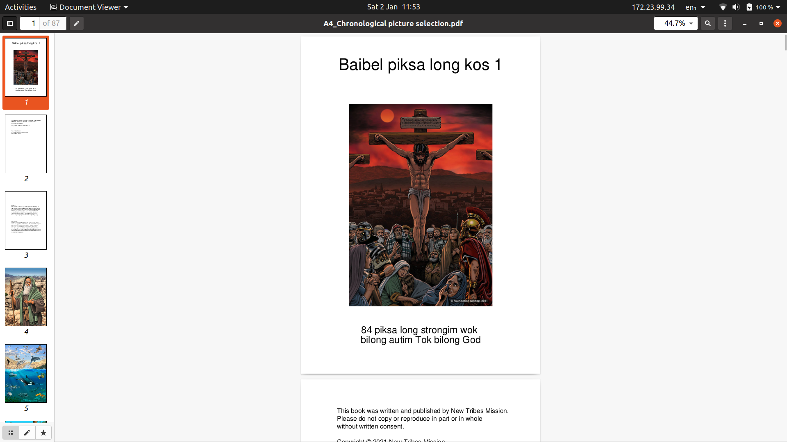

# Picture book builder
Build a pdf picture book of Bible pictures from a folder of jpegs

Creator: stephen_stanley@ntmpng.org, GPL v3

This script will take a selection of Foundation Matters chronological
pictures that you define and build them into an A4, A5 or A6 book.

- Provide a list of picture numbers
- .jpeg pictures are converted to pdf and formatted to A4, A5 or A6 books for easy printing

## Installation:
- Python must be installed on your computer https://www.python.org/
- Certain Python libraries must be installed:
 - Open a command line prompt in the script's parent folder
- Run this command:   pip3 install PyPdF2 img2pdf PIL reportlab

All options are included in the options section at the top of the script
 Change them to the desired state and then save the script and run it.
 Front matter can also be tweaked if desired.
 The most important option is that you can change which pictures go into
 your book by editing the selection list.

 ## Running the script:
 Run from the command line using python

 ## Assumptions:
 The script isn't designed to be rock solid, it relies on the following:
 - Script is located in the same folder as the foundation matters pics
 - The pictures are .jpg files
 - Pictures are named like this: 001 Prophet.jpg
      The script uses the 3 digit number at the start of the filename
 - No other files in the folder have a 3 digit number in their name

